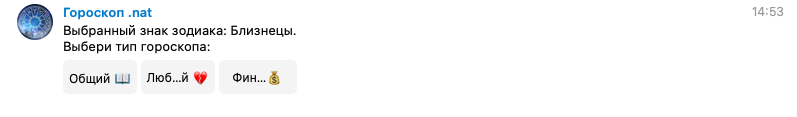
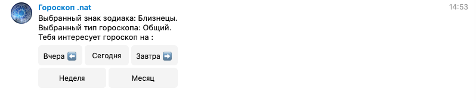
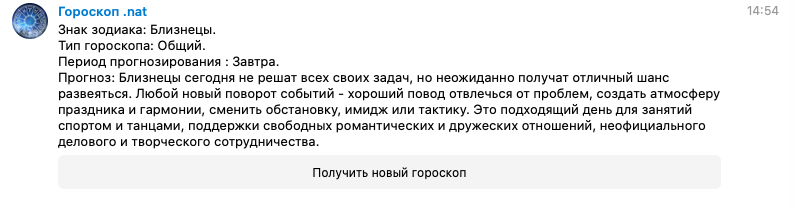
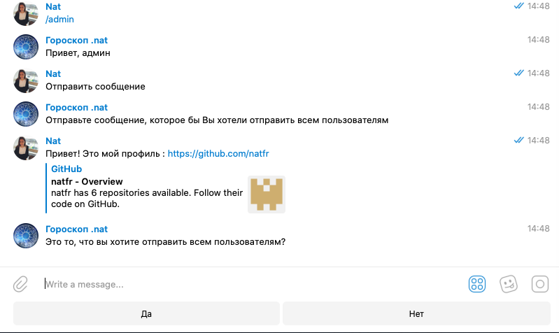

#Telegrambot "Horoscope"
__________
#### Telegrambot parsing a horoscope from the website in response to the user's request.
   The project was created for study purposes.
__________
#### Installation
   1. Install all used packages from requirements.txt (python 3.7).
   2. Create "settings.py" file with Bot_key, Proxy and etc. (please find info below).
   3. Launch "main_bot.py"
__________
#### Content
   The project includes the following files:
   1. main_bot.py
   2. horoscope.py (to parse a horoscope from a website)
   3. buttons.py (all used keyboards and buttons)
   4. settings.py (please find the info below)
   5. requirements.txt (all used packages)
   6. admin.py(functions related to admin role)
   7. analytics.py (functions collecting data about users)
   8. readme.txt (you are here :))
   9. chat_id.csv  (file with IDs of users)
   10. bot.log
   11. .gitignore
__________
#### File "settings.py"

    PROXY={'proxy_url': 'socks5h://***********'}
    HEADERS={'user-agent': '**********'}
    Bot_key='*******:******'
    Base_url='*************'
    Bot_admin=********  (integer)
__________
#### Additional references
   1. https://bitbucket.org/vkasatkin/tele_bot/src/master/echo/main.py
   2. https://bitbucket.org/vkasatkin/tele_bot/src/master/echo/main.py
   3. https://github.com/python-telegram-bot/python-telegram-bot/blob/master/examples/inlinekeyboard.py
   4. https://github.com/python-telegram-bot/python-telegram-bot/wiki/Code-snippets#post-an-image-file-from-disk    
   5. https://www.youtube.com/watch?v=JC2QSNrOUs8
   6. https://www.youtube.com/watch?v=oNbLYL8vZnE
   7. https://www.youtube.com/watch?v=FhL0uC1kGCA
   8. https://www.youtube.com/watch?v=zKuBDil5dlw&pbjreload=10
   9. https://www.youtube.com/watch?v=zKuBDil5dlw&pbjreload=10
__________
#### Contact details
   natfr (telegram)
   __________ 
#### Instruction
   If you want to get a horoscope:
   1. /start or write anything to the bot
   
   2. Choose your sign
   
   3. Choose a type of horoscope
   
   4. Choose a time period
   
   5. Done.
   
    
    
   If you are Admin and want to see all users:
   1. /admin
   2. Click 'Все пользователи' (all users)
    
   
   If you are Admin and want to send a meessage to users:
   1. /admin
   2. Click 'Отправить сообщение' (write the message)
   3. Write your message and send it to the bot
   4. If your message is ok, click 'Да' (yes) to send it to admin. You can send it to all users: go to Bot.admin.admin_approval (lines 94-104).
    
